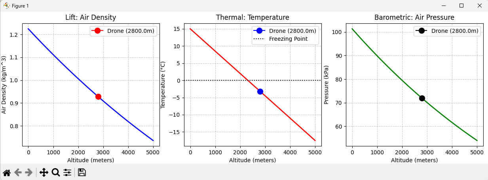

# 🚁 UAV Standard Atmosphere (ISA) Mission Profiler



## 📌 Project Overview
As UAVs scale for complex operations (like high-altitude surveillance or heavy payload delivery), environmental factors become critical points of failure. This Python-based tool uses the **International Standard Atmosphere (ISA)** mathematical model to generate instant, visual flight envelopes for drone operations.

It allows UAV System Engineers to input a target altitude and instantly verify if the air density is sufficient for propeller lift, and if the thermal environment is safe for LiPo battery operation.

## ⚙️ The Physics Engine
The core mathematical engine (`isa_engine.py`) programmatically applies atmospheric physics and thermodynamic laws (Ideal Gas Law, Tropospheric Temperature Lapse Rates) to calculate:
1. **Air Density:** To ensure sufficient motor/rotor thrust generation.
2. **Temperature:** To map battery drain risks and freezing points.
3. **Barometric Pressure:** For altimeter calibration and aerodynamic drag estimation.

## 🛠️ Technology Stack
* **Language:** Python
* **Data Processing:** `numpy` (for high-efficiency array generation of altitude envelopes)
* **Visualization:** `matplotlib` (for generating professional, multi-axis engineering dashboards)

## 🚀 How to Run the Tool
1. Clone this repository to your local machine.
2. Ensure you have the required libraries installed (`pip install numpy matplotlib`).
3. Run the dashboard file from your terminal:
   ```bash
   python dashboard.py
4. Enter your planned UAV flight altitude when prompted to generate your custom mission map. ```

##👨‍🔧 **About the Developer**
Sajjad Mehdi Naqvi *B.Sc. Aeronautics (Avionics) | Jamia Millia Islamia*

I am building a "Dual-Threat" engineering profile. My academic background gives me a deep, practical understanding of aircraft maintenance and systems (CAR 147/66). I build tools like this to bridge that hands-on maintenance knowledge with Core Aerospace Systems Design and autonomous software logic.

[Connect with me on LinkedIn)
(https://www.linkedin.com/in/sajjad-mehdi-naqvi/)
